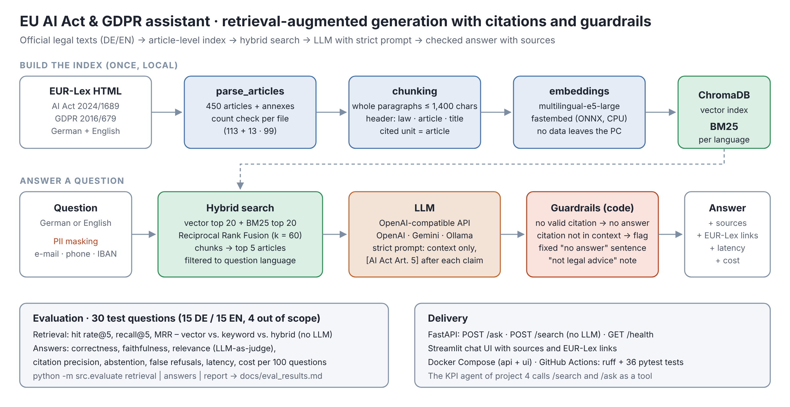
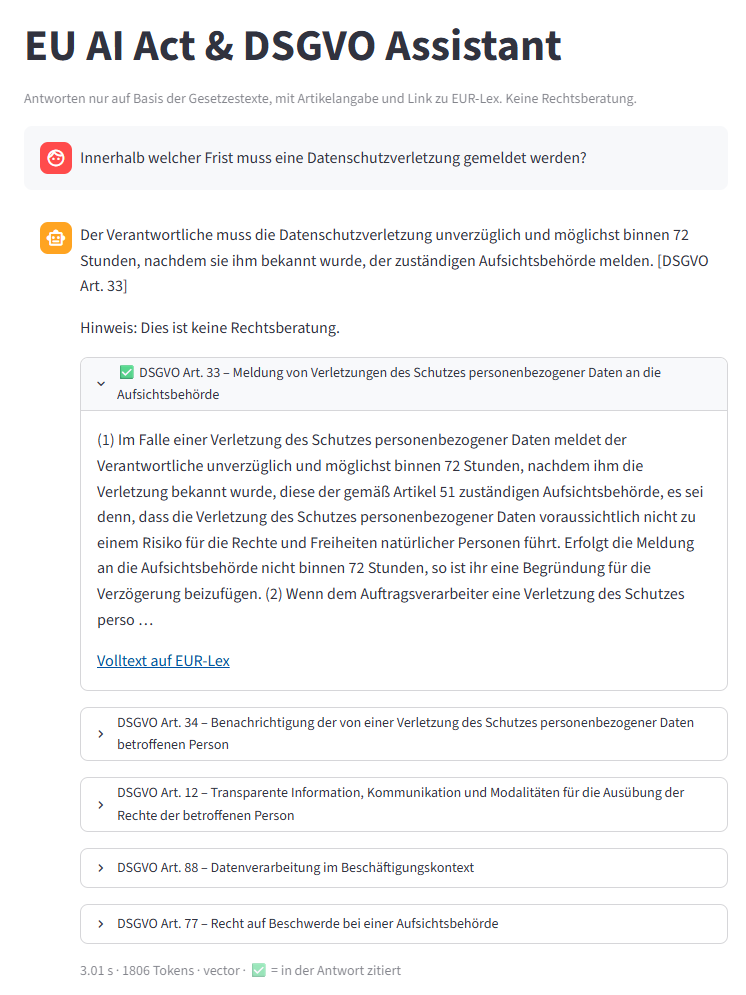
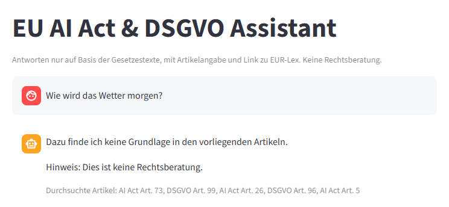

# Assistent für KI-Verordnung & DSGVO (RAG · DE/EN)

[English](README.md) · **Deutsch**

> Fragen zur KI-Verordnung und zur DSGVO auf Deutsch oder Englisch stellen. Jede Aussage nennt den Artikel, der Code verwirft Antworten ohne überprüfbare Quelle, und die Qualität wird mit 30 Testfragen gemessen.



## Ausgangslage
Seit Februar 2025 gelten die ersten Pflichten der KI-Verordnung (z. B. KI-Kompetenz, Art. 4) – zusätzlich zur DSGVO. Fachbereiche haben viele Fragen und brauchen Antworten, die sie **prüfen** können. Ein Chatbot ist dafür nur nützlich, wenn er verlässlich ist: richtige Quellen, keine erfundenen Inhalte, ein klares „weiß ich nicht“ und gemessene Qualität statt eines Demo-Eindrucks.

## Wichtigste Ergebnisse
1. **Die einfachere Suche hat gewonnen – gemessen, nicht angenommen.** Die Vektorsuche mit einem mehrsprachigen Modell fand für **26 von 26** Fragen den richtigen Artikel (Trefferquote@5 100 %, MRR 0,90). Hybrid Search war *schlechter* (96 %, 0,86): BM25 erkennt deutsche Komposita nicht („Datenschutzverletzung“ vs. „Verletzung des Schutzes personenbezogener Daten“), und Reciprocal Rank Fusion setzte dann Artikel, die in beiden Listen nur mittelmäßig waren, vor den richtigen. Die Vektorsuche ist deshalb Standard.
2. **Keine erfundenen Quellen.** Zitatgenauigkeit in allen Läufen 100 %, alle 4 Fragen außerhalb des Gesetzes abgelehnt (inkl. eines Prompt-Injection-Versuchs), 85 % der Antworten im finalen Lauf vollständig richtig.
3. **Die Evaluation fand eine Halluzination, die weder die Quellenprüfung noch der LLM-Bewerter erkannt hat** – ein richtiges Datum aus dem Gedächtnis des Modells, zitiert mit einem Artikel, in dem es nicht steht. Eine neue deterministische Prüfung (jedes Datum und jeder Betrag der Antwort muss im gefundenen Text stehen) verwirft solche Antworten jetzt.
4. **Günstig und schnell:** ≈ 2 s pro Antwort und **0,03 $ pro 100 Fragen** (`gpt-6-luna`); die Embeddings laufen lokal, die Gesetzestexte verlassen für die Suche also nicht den Rechner.

## Daten
- Verordnung (EU) 2024/1689 (KI-Verordnung: 113 Artikel, 13 Anhänge) und Verordnung (EU) 2016/679 (DSGVO: 99 Artikel), Deutsch und Englisch, amtliches HTML von [EUR-Lex](https://eur-lex.europa.eu) – Weiterverwendung mit Quellenangabe erlaubt (Beschluss 2011/833/EU)
- Zerlegt **je Artikel / Anhang** → 450 Datensätze (`data/articles.jsonl`); der Parser prüft die Anzahl je Datei

## Vorgehen
1. **Parsing** (`src/parse_articles.py`): ein Strom aus Absätzen und Tabellenzeilen; eine kleine Zustandsmaschine beginnt bei jeder Artikel- bzw. Anhangsüberschrift einen neuen Datensatz – funktioniert für das neuere (KI-VO) und das ältere (DSGVO) EUR-Lex-Layout; Fußnoten, Erwägungsgründe und Unterschriften werden ausgeschlossen, `10^25` bleibt lesbar
2. **Chunking** (`src/chunking.py`): lange Artikel (Art. 3 KI-VO ≈ 17.000 Zeichen) werden an Absatzgrenzen geteilt; jeder Chunk trägt Gesetz, Artikel und Titel. Gesucht wird in Chunks, zitiert wird immer der **Artikel**
3. **Retrieval** (`src/retrieval.py`): lokale Embeddings (`multilingual-e5-large`, fastembed/ONNX) in ChromaDB, BM25 mit deutschem/englischem Stemming und **Hybrid Search** mit Reciprocal Rank Fusion; Treffer werden auf die Sprache der Frage gefiltert
4. **Generierung** (`src/rag.py`, `prompts/system_prompt.md`): jedes OpenAI-kompatible Modell (Standard: OpenAI API; ebenso vorbereitet für das kostenlose Gemini-Kontingent und ein lokales Ollama). Nur Kontext, Quelle nach jeder Aussage, fester „keine Antwort“-Satz
5. **Guardrails im Code**, nicht nur im Prompt: personenbezogene Daten vor Suche und LLM maskiert · Antwort ohne gültige Quelle → „keine Antwort“ · jedes Datum und jeder Betrag muss im gefundenen Text stehen, sonst „keine Antwort“ · Zitate von Artikeln, die nicht gefunden wurden, werden markiert · Antwortsprache wird explizit vorgegeben · Hinweis „keine Rechtsberatung“ immer ergänzt
6. **Evaluation** (`src/evaluate.py`): 30 Fragen (15 DE / 15 EN, davon 4 außerhalb des Gesetzes, 1 Prompt-Injection), Retrieval-Kennzahlen ohne LLM und Antwortqualität mit LLM als Bewerter
7. **Bereitstellung**: FastAPI (`/ask`, `/search`, `/health`), Streamlit-Chat mit Quellen und EUR-Lex-Links, Docker Compose, GitHub Actions

## Ergebnisse
Finaler Lauf (`gpt-6-luna`, Reasoning-Aufwand niedrig, k = 5 Artikel, 26 beantwortbare + 4 Fragen außerhalb des Gesetzes):

| Modus | Trefferquote @5 | MRR | Richtig | Faithfulness | Zitatgenauigkeit | Außerhalb abgelehnt | Fälschlich abgelehnt | Latenz | Kosten / 100 Fragen |
|---|---|---|---|---|---|---|---|---|---|
| **vector** (Standard) | **100 %** | **0,904** | **85 %** | 98 % | 100 % | 4/4 | 1/26 | 2,1 s | 0,03 $ |
| keyword (BM25) | 92 % | 0,792 | – | – | – | – | – | – | – |
| hybrid (RRF) | 96 % | 0,856 | 81 % | 100 % | 100 % | 4/4 | 3/26 | 1,9 s | 0,03 $ |

Vollständige Tabelle und jede Antwort: [docs/eval_results.md](docs/eval_results.md) · [docs/eval_per_question.csv](docs/eval_per_question.csv)

**Drei Evaluationsläufe – was sich geändert hat und warum**

| Lauf | Änderung | Richtig (vector / hybrid) | Erkenntnis |
|---|---|---|---|
| 1 | erste Version | 96 % / 77 % | eine englische Frage auf Deutsch beantwortet → Antwortsprache wird jetzt explizit vorgegeben |
| 2 | Antwortsprache | 100 % / 85 % | die „100 %“ enthielten ein richtiges Datum, das **nicht** im gefundenen Text stand (q01) |
| 3 | Faktenprüfung | **85 % / 81 %** | q01 wird jetzt abgelehnt; übrige Fehler sind unvollständige Antworten (q10, q24) und eine umgekehrte Bedingung (q13) |

Die Vektorsuche war in jedem Lauf besser als Hybrid. Die Streuung zwischen den Läufen (bis zu 15 Punkte bei identischem Retrieval) zeigt die Varianz des LLM bei 26 Fragen – die Zahlen sind Tendenzen, keine exakten Quoten. Bekannte Lücke im Retrieval: „Ab wann gelten die Verbote …?“ braucht Art. 113 (Geltungsbeginn), den kein Suchmodus unter die ersten 5 bringt. In den Evaluationsläufen lehnte das System ab; in einem Live-Test antwortete es „2. August 2025“ – ein Datum, das im gefundenen Art. 111 **steht**, aber zu einer anderen Regel gehört (KI-Modelle mit allgemeinem Verwendungszweck). Die Faktenprüfung kann ein Datum aus der falschen Vorschrift nicht erkennen; das behebt nur ein besseres Retrieval (siehe Nächste Schritte).

## Screenshots
| Antwort mit Quellen und EUR-Lex-Links | Ablehnung außerhalb des Gesetzes |
|---|---|
|  |  |

REST-API (FastAPI / OpenAPI): [images/03_api_docs.png](images/03_api_docs.png)

## Ausführen
```bash
pip install -r requirements.txt
cp .env.example .env                      # LLM_API_KEY, CHAT_MODEL und Preise eintragen
python -m src.download_eurlex             # 4 HTML-Dateien → data/raw/
python -m src.parse_articles              # → data/articles.jsonl (450 Datensätze, Anzahl geprüft)
python -m src.build_index                 # lokale Embeddings → chroma_db/ (lädt beim ersten Mal das Modell)
python -m src.evaluate retrieval          # kostenlos, ohne LLM
python -m src.evaluate answers            # mit LLM, zwischengespeichert und fortsetzbar
python -m src.evaluate report             # → docs/eval_results.md
uvicorn src.api:app                       # http://127.0.0.1:8000/docs
streamlit run app.py                      # http://localhost:8501
docker compose up --build                 # API + UI im Container (Index vom Host)
```
Erwartete Ausgabe jedes Schritts: [docs/expected-results.md](docs/expected-results.md)

## Tests
`pytest` – 39 Tests ohne Netzwerk und ohne Modell: beide EUR-Lex-Layouts (Fußnoten, verschachtelte Aufzählungen, zitierte Artikel, Anhänge nach der Unterschrift), Chunking, RRF und Stemming, Suche in allen drei Modi auf einer temporären ChromaDB, Guardrails (Quellen, Daten und Beträge) und PII-Maskierung, LLM-Client (auch Reasoning-Modelle ohne `temperature`), Kennzahlen, API. Die CI führt bei jedem Push `ruff` und `pytest` aus und baut das Docker-Image (mit Importprüfung im Container).

## Bezug zu meiner Erfahrung
In der Lieferantenauditierung bei BMW habe ich täglich mit Anforderungen gearbeitet, die in Normen und Regelwerken stehen – und gelernt, dass eine Aussage nur zählt, wenn man ihre Quelle nennen kann. Als Six Sigma Black Belt messe ich, bevor ich verbessere. Beides steckt in diesem Projekt: jede Antwort mit Artikelangabe, und die Qualität mit festen Testfragen und Kennzahlen statt nach Gefühl bewertet.

## Grenzen
- Keine Rechtsberatung. Erwägungsgründe und spätere Änderungen/Berichtigungen sind in Version 1 nicht indexiert
- Der LLM-Bewerter stammt aus derselben Modellfamilie wie das antwortende Modell; 30 Fragen zeigen Tendenzen, keine statistische Sicherheit
- Die Faktenprüfung deckt Daten und Beträge ab, keine anderen Aussagen; je Lauf bleibt eine unvollständige oder umgekehrte Bedingung (siehe q10, q13)

## Nächste Schritte
- Vorschriften zum Geltungsbeginn stärker gewichten oder Fragen „Ab wann gilt …?“ gezielt dorthin leiten (behebt q01)
- Zerlegung deutscher Komposita für BM25 und gewichtete RRF – getestet auf einem **separaten** Fragenset, nicht auf diese 30 abgestimmt
- Größeres Testset gemeinsam mit Fachleuten aus dem Recht; ein zweites, anderes Bewertungsmodell
- Die PII-Maskierung erkennt E-Mail, Telefonnummern und IBAN, keine Namen
- Datenschutz: personenbezogene Daten werden vor jedem LLM-Aufruf maskiert; die OpenAI API nutzt API-Daten standardmäßig nicht zum Training (Speicherung bis zu 30 Tage zur Missbrauchserkennung). Im kostenlosen Gemini-Kontingent darf Google Eingaben zur Produktverbesserung nutzen – für öffentliches Recht vertretbar, nicht für Unternehmensdaten; vollständig lokal: Ollama

---
*Autorin: Mahsa Ahmadi · Ausschließlich öffentliche Gesetzestexte. Keine Rechtsberatung.*
